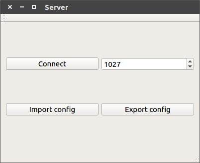
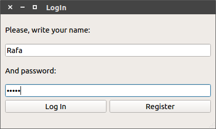
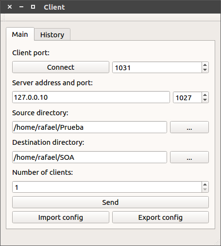
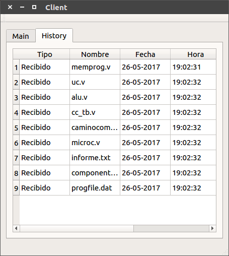
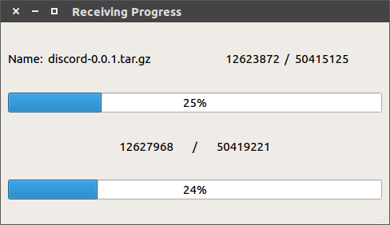

# soa-distributed-backup versión grupal 

Hemos diseñado nuestro propio sistema de backup distribuido.

## Requisitos

 1. Se debe clonar el proyecto del [repositorio de GitHub](https://github.com/alu0100891812/soa-system-monitor-alu0100891812).
 2. Se debe tener instalado el IDE [Qt Creator 5.8](https://www.qt.io/download-open-source/).

## Instalación

 1. Posicionarnos dentro del directorio del proyecto y utilizar $git submodule update --init
 2. Entrar al directorio "QttpServer" y utilizar $git submodule update --init
 3. Compilar el proyecto "qttpserver.pro" para crear las librerías necesarias.
 4. Realizar sudo make install en la carpeta make de Cliente y Servidor o , en caso del cliente instalar el .deb contenido en la carpeta make.
 5. El programa ya está instalado.
 
## Como ejecutar

 1. Una vez instalado, el servidor puede ejecutarse poniendo distributed-backup-server. Podemos pasarle una opción -d para ejecutar en modo gráfico o pasandole la opción -p y el número de puerto para ejecutar en modo demonio.
 2. Una vez instalado, el cliente puede ejecutarse desde el acceso directo client  o ejecutando Client en una terminal con las opciones de comandos -cd (client_port), -sp (server_port), -sa (server_address),
-dd (destination_directory), -ds (source_directory).

## Programa

Hemos diseñado dos programas: un servidor y un cliente de backup.

### El servidor:

*  Se encarga de escuchar las peticiones de los clientes en un puerto seleccionado en la GUI o linea de comandos antes de conectar.
*  Tambien se encarga de mantener un registro de los clientes conectados, y comprobar si siguen vivos mediante un Keep Alive.
*  El servidor envía los datos recibidos del cliente origen a los clientes destino, que deben reconstruir el arbol de directorios en su carpeta local.
*  Se ha implementado además su versión en modo demonio. Este cuenta con un archivo syslog que tiene mensajes informativos acerca del estado del servidor.
*  Se ha implementado una base de datos en la que se mantiene un registro de usuarios que pueden iniciar sesión para transferir archivos.

### La ventana de Log In:

*  Esta ventana aparecera al abrir el cliente y permitirá el registro y el inicio de sesión introduciendo un nombre de usuario y una contraseña.

### El cliente:

*  Al mismo tiempo que el servidor esta escuchando se pueden estar ejecutando múltiples clientes en distintas máquinas.
*  Cualquier cliente podrá ser el origen de los datos a copiar. Los leerá y enviará al servidor para su retransmisión.
*  El resto recibirán los datos desde el servidor para hacer la copia de seguridad en un directorio local.
*  La IP y el puerto del servidor al que deben conectarse los clientes debe ser configurable desde la GUI, al igual que el puerto donde se conectara el cliente.
*  En cada cliente la carpeta origen o destino de los archivos es configurable desde la GUI.
*  Si el cliente solo quiere recibir esperan indefinidamente hasta que el servidor inicia la transferencia
*  Si el cliente quiere enviar espera hasta que hay suficientes clientes conectados en el servidor, entonces empieza a recorrer el directorio y a transferir hacia el servidor.
*  Se han incluido medidas de contrapresión para evitar problemas de perdida de paquetes, o fallos por la discordancia entre la velocidad de envio y la de recepción.
*  Se ha implentado una base de datos que guarda los archivos enviados y recibidos para que puedan ser consultados la pestaña History.

 
### La ventana de progreso:

Durante la transferencia se muestra una ventana con:
*  El nombre del archivo que se está copiando actualmente.
*  Una barra de progreso global de toda la copia y otra barra de progreso sobre la copia del archivo actual.

### Opciones de configuración:

*  Tanto usuario como cliente cuentan con un botón en modo ui para exportar una configuración guardada en seciones anteriores, en caso de no seleccionar ninguna tendremos una configuración por defecto.
 
### Controlar el servidor

*  Se han implementado urls para la manipulación del servidor y el control de este pudiendo consultar el estado del servidor, usuarios conectados... y pudiendo realizar acciones como parar, pausar ... la actividad del servidor.
*  Se ha implementado además una url para consultar las estadísticas del servidor.

Proyecto realizado por el grupo mdrgroup para la asignatura Sistemas Operativos Avanzados 
3º Ingeniería informática Universidad de La Laguna
