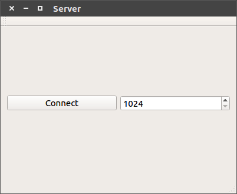
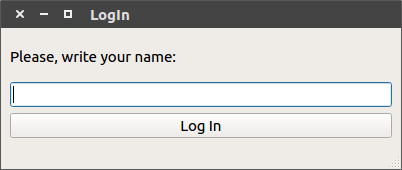
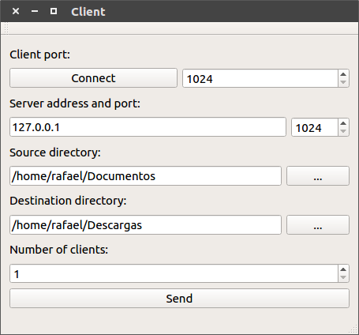
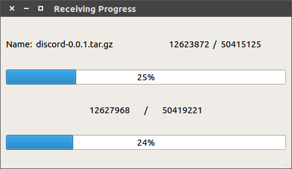

# Backup distribuido

Hemos diseñado nuestro propio sistema de backup distribuido.

## Requisitos

 1. Se debe clonar el proyecto del [repositorio de GitHub](https://github.com/alu0100891812/soa-system-monitor-alu0100891812).
 2. Se debe tener instalado el IDE [Qt Creator 5.8](https://www.qt.io/download-open-source/).

## Cómo compilar
 
 1. Una vez instalado se debe iniciar y abrir el archivo de proyecto de Qt, el archivo **SystemMonitor.pro** dentro de la carpeta SystemMonitor del repositorio clonado.
 2. Después se debe hacer clic en el boton con forma de martillo abajo a la izquierda. 
 3. El programa ya esta compilado!!.
 
## Como ejecutar

 1. Si no ha hecho los pasos de como compilar vuelva atras y siga esos pasos. 
 2. Después se debe hacer clic en el boton verde de Play abajo a la izquierda. 
 3. Ya deberia haberle compilado e iniciado el programa.

## Programa
Hemos diseñado dos programas: un servidor y un cliente de backup.

###El servidor:

*  Se encarga de escuchar las peticiones de los clientes en un puerto seleccionado en la GUI antes de conectar.
*  Tambien se encarga de mantener un registro de los clientes conectados, y comprobar si siguen vivos mediante un Keep Alive.
*  El servidor envía los datos recibidos del cliente origen a los clientes destino, que deben reconstruir el arbol de directorios en su carpeta local.

###La ventana de Log In:

*  Esta ventana aparecera nada mas abrir el cliente y te permitira introducir tu nombre para diferenciar tus archivos de los de otros usuarios, es obligatorio introducir un nombre.

###El cliente:

*  Al mismo tiempo que el servidor esta escuchando se pueden estar ejecutando múltiples clientes en distintas máquinas.
*  Cualquier cliente podrá ser el origen de los datos a copiar. Los leerá y enviará al servidor para su retransmisión.
*  El resto recibirán los datos desde el servidor para hacer la copia de seguridad en un directorio local.
*  La IP y el puerto del servidor al que deben conectarse los clientes debe ser configurable desde la GUI, al igual que el puerto donde se conectara el cliente.
*  En cada cliente la carpeta origen o destino de los archivos es configurable desde la GUI.
*  Si el cliente solo quiere recibir esperan indefinidamente hasta que el servidor inicia la transferencia
*  Si el cliente quiere enviar espera hasta que hay suficientes clientes conectados en el servidor, entonces empieza a recorrer el directorio y a transferir hacia el servidor.
*  Se han incluido medidas de contrapresión para evitar problemas de perdida de paquetes, o fallos por la discordancia entre la velocidad de envio y la de recepción.
 
###La ventana de progreso:

Durante la transferencia se muestra una ventana con:
*  El nombre del archivo que se está copiando actualmente.
*  Una barra de progreso global de toda la copia y otra barra de progreso sobre la copia del archivo actual.
