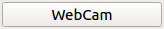
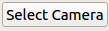
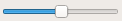
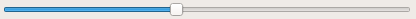

# Media Player

Con la ayuda de Qt hemos creado nuestro propio reproductor multimedia.

## Requisitos

 1. Se debe clonar el proyecto del [repositorio de GitHub](https://github.com/alu0100891812/soa-media-player-alu0100891812.git)
 2. Se debe tener instalado el IDE [Qt Creator 5.8](https://www.qt.io/download-open-source/).
 3. Se debe tener codecs de mp4 instalado, se pueden conseguir descargando el [VLC](https://www.videolan.org/vlc/#download)

## Cómo compilar
 
 1. Una vez instalado se debe iniciar y abrir el archivo de proyecto de Qt, el archivo **MediaPlayer.pro** dentro de la carpeta MediaPlayer del repositorio clonado.
 2. Después se debe hacer clic en el boton con forma de martillo abajo a la izquierda. 
 3. El programa ya esta compilado!!.
 
## Como ejecutar

 1. Si no ha hecho los pasos de como compilar vuelva atras y siga esos pasos. 
 2. Después se debe hacer clic en el boton verde de Play abajo a la izquierda. 
 3. Ya deberia haberle compilado e iniciado el programa.

## Caracteristicas implementadas

Nuestro programa es capaz de reproducir video y la salida de la camara de nuestro ordenador, siendo capaces de elegir entre todas las camaras disponibles.

Para ello en la interfaz puede utilizar diferentes botones:

 * **Webcam**, para iniciar la captura de la webcam. 
 * **Select Camera**, para seleccionar la webcam desde la que se realizara la captura. 
 * **Play / Pause**, para iniciar o pausar la reproducción de una película.  
   * Si no hay ningun video reproduciendose o se esta reproduciendo la camara se abrirá una ventana para seleccionar el video que desee reproducir.
   * Si se estaba reproduciendo un video el boton cambiara a pausa, si se pulsa sobre él, el video se pondrá en pausa.
 * **Stop**, para detener la reproducción del video o la captura de la webcam. 
 * **Rewind**, para reproducir la video hacia atrás. 
 * **Forward**, para reproducir la video hacia adelante de forma acelerada. 
 * **VolumeBar**, una barra con el estado del volumen del video, con capacidad de interactuar con ella para aumentar o disminuir el volumen. 
 * **Mute**, para silenciar o desilenciar el volumen.  
 * **ProgressBar**, una barra de estado de la reproducción del video, con capacidad de interactuar con ella para avanzar o retroceder en el video. 
