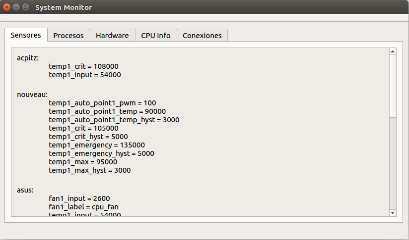
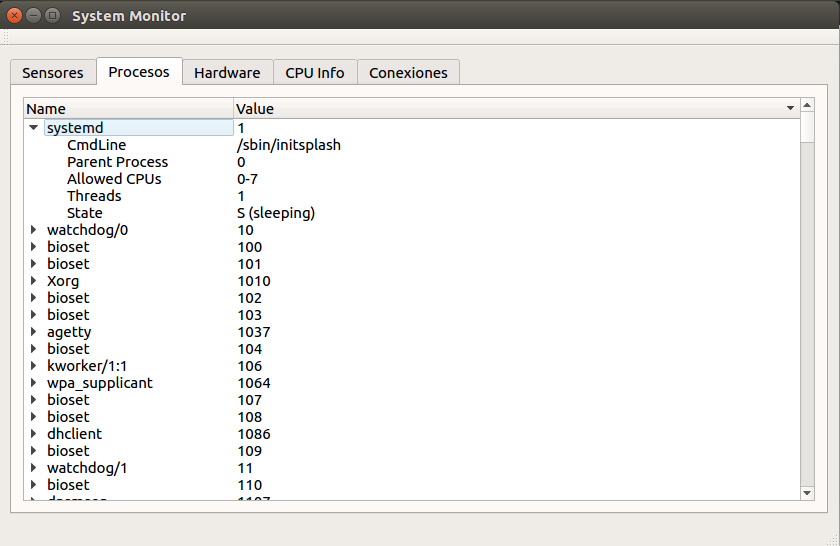
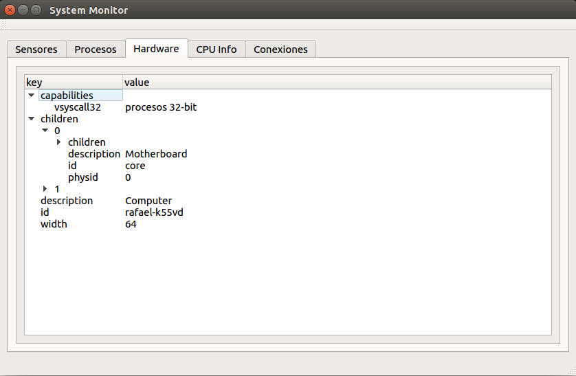
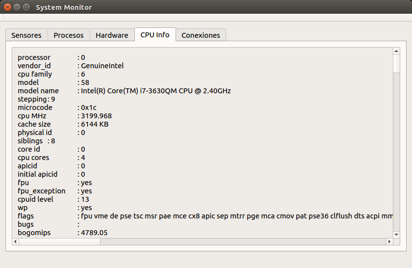
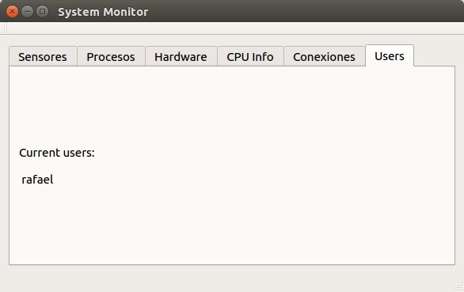

# System Monitor

Con la ayuda de Qt hemos creado nuestro propio monitor del sistema. Nos permitirá examinar: procesos en ejecución, conexiones abiertas, temperatura de la CPU, hardware del sistema, etc.

## Requisitos

 1. Se debe clonar el proyecto del [repositorio de GitHub](https://github.com/alu0100891812/soa-system-monitor-alu0100891812).
 2. Se debe tener instalado el IDE [Qt Creator 5.8](https://www.qt.io/download-open-source/).

## Cómo compilar
 
 1. Una vez instalado se debe iniciar y abrir el archivo de proyecto de Qt, el archivo **SystemMonitor.pro** dentro de la carpeta SystemMonitor del repositorio clonado.
 2. Después se debe hacer clic en el boton con forma de martillo abajo a la izquierda. 
 3. El programa ya esta compilado!!.
 
## Como ejecutar

 1. Si no ha hecho los pasos de como compilar vuelva atras y siga esos pasos. 
 2. Después se debe hacer clic en el boton verde de Play abajo a la izquierda. 
 3. Ya deberia haberle compilado e iniciado el programa.

## Caracteristicas Principales

  La ventana principal es algo así:

  

  Esta ventana consta de diferentes pestañas:

### Sensores

  Esta pestaña del programa muestra la información de los sensores instalados en el hardware detectado por el sistema operativo. En esta pestaña se diferencia por sensor y para cada uno de ellos se muestran sus valores.

  

### Procesos

  Esta pestaña del programa muestra la informacion de los procesos ejecutandose actualmente en la maquina, periodicamente añadiendo nuevos procesos creados y borrando procesos cerrados. Además de ello se puede observar ciertas caracteristicas de los procesos como su Pid, Pid de su proceso padre, su CmdLine, su estado actual, los hilos ocupados y los nucleos en los que se puede ejecutar.

  

### Hardware

  Esta pestaña del programa muestra la informacion del hardware de nuestro ordenador(En una vista de arbol), con todas las caracteristicas posibles.

  

### CPU Info

  Esta pestaña del programa muestra la informacion de la CPU de nuestro ordenador con todas sus caracteristicas.

  

### Red

  Esta pestaña del programa muestra la informacion de las conexiones abiertas en el ordenador y sus caracteristicas, y estas separadas por protocolos Tcp, Udp y Unix

  

### Usuarios

  Esta pestaña del programa muestra el nombre de los usuarios con sesiones abiertas en la maquina

  

## Tecnicas de manejo de la concurrencia

  En mi opinion la mejor tecnica de manejo de la concurrencia es el pool de threads, porque es sencillo de implementar, es escalable, es bastante modular porque se diferencia bien la función en la que se divide el trabajo, la función en la que se ejecuta el trabajo, y la función en la que se maneja el resultado, y además aprovecha todos los hilos del la maquina en que se ejecute.
  
  Sin embargo la tecnica usada en la tercera parte de la practica me ha resultado aun mas sencillo, mas flexible, y estructura aun mejor el codigo, aunque pienso que seguramente no sea tan eficiente como el pool de threads.

